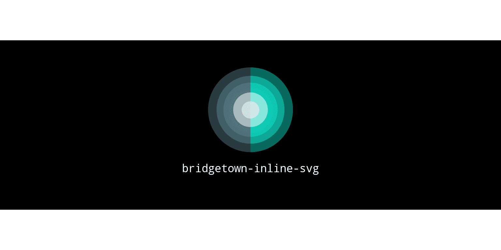

<div align="center">
  
  <h1>bridgetown-inline-svg</h1>
  <p>
    <a href="LICENSE" target="_blank">
      
    </a>
    <a href="https://badge.fury.io/rb/bridgetown-inline-svg"></a>
    <a href="https://depfu.com"></a>
    <a href="https://depfu.com/github/andrewmcodes/bridgetown-inline-svg?project_id=14094"></a>
    <a href="https://codeclimate.com/github/andrewmcodes/bridgetown-inline-svg/maintainability"></a>
    <a href="https://www.codacy.com/manual/andrewmcodes/bridgetown-inline-svg?utm_source=github.com&amp;utm_medium=referral&amp;utm_content=andrewmcodes/bridgetown-inline-svg&amp;utm_campaign=Badge_Grade"></a>
    <a href='https://coveralls.io/github/andrewmcodes/bridgetown-inline-svg?branch=main'></a>
    
    
  </p>
</div>

- [Installation](#installation)
- [Optional Configuration](#optional-configuration)
- [Demo](#demo)
- [Usage](#usage)
  - [Attributes](#attributes)
    - [Height and Width](#height-and-width)
  - [Paths](#paths)
  - [Variables](#variables)
  - [Optimizations](#optimizations)
- [Contributing](#contributing)
- [Acknowledgement](#acknowledgement)
- [License](#license)

## Installation

Run this command to add this plugin to your site's Gemfile:

```shell
bundle add bridgetown-inline-svg -g bridgetown_plugins
```

or add the following to your `Gemfile`:

```ruby
group :bridgetown_plugins do
  gem "bridgetown-inline-svg", "~> 1.0.0"
end
```

## Optional Configuration

```yml
# bridgetown.config.yml

svg:
  # Whether to optimize the SVG files with svg_optimizer.
  #
  # Type: Boolean
  # Optional: true
  # Default: false
  optimize: true
```

## Demo

[bridgetown-inline-svg-starter](https://github.com/andrewmcodes/bridgetown-inline-svg-starter)

This starter can be used to reproduce issues as well as provide an example of the plugin's usage.

## Usage

This plugin provides the `svg` Liquid tag to your site.

Use the tag in your pages, collections, components, etc. by passing the tag the name of a file:

```liquid

```

**Note**: The `.svg` file extension is required.

### Attributes

Set attributes just like you would in HTML.

For example:

```liquid

```

Bridgetown will include the SVG file in your output HTML like this:

```html
<svg width="24" height="24" class="text-indigo-600" foo="bar" version="1.1" id="square" xmlns="http://www.w3.org/2000/svg" x="0" y="0" viewBox="0 0 24 24" >
  <rect width="20" height="20" x="2" y="2" />
</svg>
```

**Note**: Anything can be passed through, but we'd recommend only setting [valid attributes](https://developer.mozilla.org/en-US/docs/Web/SVG/Element/svg#Attributes).

#### Height and Width

`height` is automatically set to match `width` if omitted, and vice versa. Height specifically can't be left unset because IE11 won't use the viewport attribute to calculate the image's aspect ratio.

### Paths

Paths with a space should be quoted with single or double quotes:

```liquid

```

If the path is not in quotes, anything after the __first space__ will be considered an attribute.

Relative paths and absolute paths will both be interpreted from Bridgetown's `src` directory. So both:

```liquid


```

Should resolve to `/your/site/src/path/to/my.svg` and are equivalent.

### Variables

Liquid variables will be interpolated if enclosed in double brackets:

```liquid



```

This is especially helpful inside of Liquid components!

### Optimizations

Some processing is done to remove useless data when enabled:

- metadata
- comments
- unused groups
- Other filters from [svg_optimizer](https://github.com/fnando/svg_optimizer)
- default size

If any important data gets removed, or the output SVG looks different from input, it's a bug. Please file an issue to this repository describing your problem.

It does not perform any input validation on attributes. They will be appended as-is to the root node.

## Contributing

Contributions, issues and feature requests are welcome!<br />Feel free to check [issues page](https://github.com/andrewmcodes/bridgetown-inline-svg/issues). You can also take a look at the [contributing guide](https://github.com/andrewmcodes/bridgetown-inline-svg/blob/main/CONTRIBUTING.md).

## Acknowledgement

This project was initially forked from [jekyll-inline-svg](https://github.com/sdumetz/jekyll-inline-svg).

## License

Copyright © 2017-2020 [Sebastien Dumetz](https://github.com/sdumetz)
Copyright © 2020 [Andrew Mason](https://github.com/andrewmcodes)

The following code is a derivative work of the code from the [jekyll-inline-svg](https://github.com/sdumetz/jekyll-inline-svg) project, which is licensed GPLv3. This code therefore is also licensed under the terms of the GNU Public License, verison 3.
